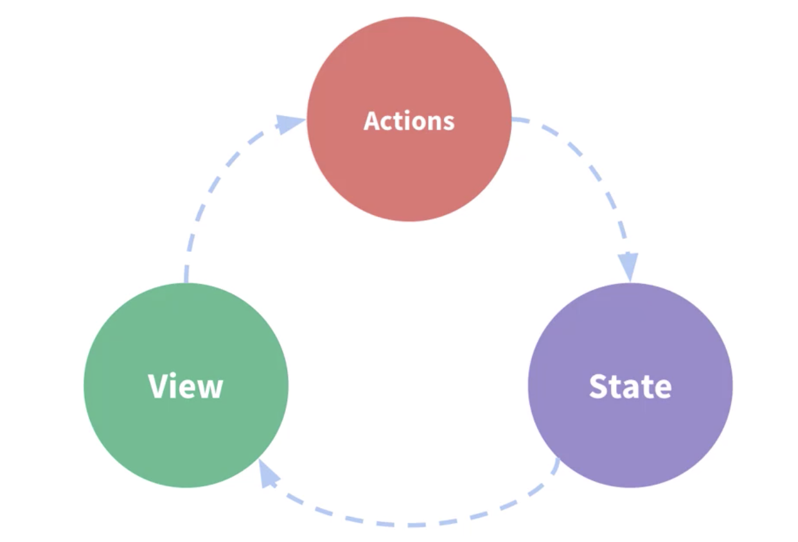
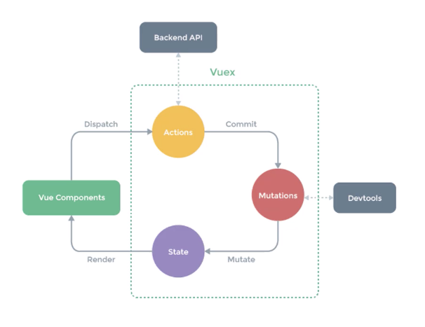

# 任务一：Vuex 状态管理

## 课程目标

- Vue 组件间通信方式回顾
- Vuex 核心概念和基本使用回顾
- 购物车案例
- 模拟 实现 Vuex

## Vue 组件间通信方式

### 组件内状态管理流程

Vue 核心 是 数据驱动和组件交换

大多数场景下的组件都并不是独立存在的，而是相互协作共同构成了一个复杂的业务功能。在 Vue 中为不同的组件关系提供了不同的通信规则。

```jsx
// 回顾 Vue 状态管理
new Vue({
	// state
	data () {
		return {
			count:  0
		}
	},
	// view
	template: `
		<div>{{ count }}</div>
	`,
	// action
	methods: {
		increment () {
			this.count++
		}
	}
})
```

状态管理

state : 驱动应用的数据源

view : 以声明方式将 state 映射到视图

actions : 相应 在 view 上的用户输入导致的状态变化



### 三种组件间通信方式 — 父传子 Props Down

- 子组件中通过 props 接收数据
- 父组件中给子组件通过相应属性传值

```jsx
// parent.vue
<template>
  <div>
      <h1>Props Down Parents</h1>
      <Child title="My journey with Vue"></Child>
  </div>
</template>

<script>
import Child from './01-child'
export default {
    components: {
        Child
    }
}
</script>

// child.vue
<template>
  <div>
      <h1>Props Down Child</h1>
      <h2>{{ title }} </h2>
  </div>
</template>

<script>
export default {
    props: {
        title: String
    }
}
</script>
```

### 三种组件间通信方式 — 子传父 Event Up

```jsx
// child.vue
<template>
  <div>
      <h1 :style="{fontSize: fontSize + 'em'}">Event Up Child</h1>
      <button @click="handler">文字增大</button>
  </div>
</template>

<script>
export default {
    props: {
        fontSize: Number
    },
    methods: {
        handler () {
            this.$emit('enlargeText', 0.5)
        }
    }
}
</script>

// parent.vue
<template>
    <div>
        <h1 :style="{ fontSize: hFontSize + 'em'}">Event Up Parent</h1>
        
        <Child :fontSize="hFontSize" v-on:enlargeText="handleEnlarge"></Child>
    
    </div>
</template>

<script>
import Child from './02-child'

export default {
    components: {
        Child
    },
    data () {
        return {
            hFontSize: 1
        }
    },
    methods: {
        handleEnlarge (size) {
            console.log(size)
            this.hFontSize += size
        }
    }
}
</script>
```

### 三种组件间通信方式 — 不相关组件传值 Event Bus

创建 eventbus，公共的 vue 实例，作为事件中心。

```jsx
// eventbus.js
import Vue from 'vue'
export default new Vue()

// 03-Sibling-01.vue
<template>
    <div>
        <h1>Event Bus Sibling01</h1>
        <div class="number" @click="sub">-</div>
        <input type="text" style="width: 30px; text-align: center" :value="value">
        <div class="number" @click="add">+</div>
    </div>
</template>

<script>
import bus from './eventbus'

export default {
    props: {
        num: Number
    },
    created () {
        this.value = this.num
    },
    data () {
        return {
            value: -1
        }
    },
    methods: {
        sub () {
            if (this.value > 1) {
                this.value--
                bus.$emit('numchange', this.value)
            }
        },
        add () {
            this.value++
            bus.$emit('numchange', this.value)
        }
    }
}
</script>

<style>
.number {
  display: inline-block;
  cursor: pointer;
  width: 20px;
  text-align: center;
}
</style>

// 03-Sibling-02.vue
<template>
    <div>
        <h1>Event Bus Sibling02</h1>
        <div>{{ msg }}</div>
    </div>
</template>

<script>
import bus from './eventbus'

export default {
    data () {
        return {
            msg: ''
        }
    },
    created () {
        bus.$on('numchange', value => {
            this.msg = `您选择了${value}件商品`
        })
    }
}
</script>
```

### 其他组件通信方式

其他常见方式：（不推荐，只有在项目小，或开发自定义组件时，使用到；大型项目，推荐 Vuex）

- $root
- $parent
- $children
- $refs

**通过 ref 获取子组件**

ref 两个作用：

- 在普通 HTML 标签上使用 ref，获取到的是 DOM
- 在组件标签上使用 ref，获取到的是组件实例

注：$refs只会在组件渲染完成之后生效，并且它们不是响应式的。这仅作为一个用于直接操作子组件的“逃生舱”——你应该避免在模板或计算属性中访问$refs。

```jsx
// child.vue
<template>
  <div>
    <h1>ref Child</h1>
    <input ref="input" type="text" v-model="value">
  </div>
</template>

<script>
export default {
  data () {
    return {
      value: ''
    }
  },
  methods: {
    focus () {
      this.$refs.input.focus()
    }
  }
}
</script>

// parent.vue
<template>
  <div>
    <h1>ref Parent</h1>

    <child ref="c"></child>
  </div>
</template>

<script>
import child from './04-Child'
export default {
  components: {
    child
  },
  mounted () {
    this.$refs.c.focus()
    this.$refs.c.value = 'hello input'
  }
}
</script>
```

## 简易的状态管理方案

如果多个组件之间要共享状态(数据)，使用上面的方式虽然可以实现，但是比较麻烦，而且多个组件之间互相传值很难跟踪数据的变化，如果出现问题很难定位问题。当遇到多个组件需要共享状态的时候，典型的场景：购物车。我们如果使用上述的方案都不合适，我们会遇到以下的问题

- 多个视图依赖于同一状态。
- 来自不同视图的行为需要变更同一状态。

对于问题一，传参的方法对于多层嵌套的组件将会非常繁琐，并且对于兄弟组件间的状态传递无能为力。

对于问题二，我们经常会采用父子组件直接引用或者通过事件来变更和同步状态的多份拷贝。以上的这些模式非常脆弱，通常会导致无法维护的代码。

因此，我们为什么不把组件的共享状态抽取出来，以一个全局单例模式管理呢？在这种模式下，我们的组件树构成了一个巨大的“视图”，不管在树的哪个位置，任何组件都能获取状态或者触发行为！我们可以把多个组件的状态，或者整个程序的状态放到一个集中的位置存储，并且可以检测到数据的更改。你可能已经想到了 Vuex。

这里我们先以一种简单的方式来实现

```jsx
// Component A
<template>
  <div>
    <h1>componentA</h1>
    user name: {{ sharedState.user.name }}
    <button @click="change">Change Info</button>
  </div>
</template>

<script>
import store from './store'
export default {
  methods: {
    change () {
      store.setUserNameAction('componentA')
    }
  },
  data () {
    return {
      privateState: {},
      sharedState: store.state
    }
  }
}
</script>

// Component B
<template>
  <div>
    <h1>componentB</h1>
    user name: {{ sharedState.user.name }}
    <button @click="change">Change Info</button>
  </div>
</template>

<script>
import store from './store'
export default {
  methods: {
    change () {
      store.setUserNameAction('componentB')
    }
  },
  data () {
    return {
      privateState: {},
      sharedState: store.state
    }
  }
}
</script>

// store.js
export default {
  debug: true,
  state: {
    user: {
      name: 'xiaomao',
      age: 18,
      sex: '男'
    }
  },
  setUserNameAction (name) {
    if (this.debug) {
      console.log('setUserNameAction triggered：', name)
    }
    this.state.user.name = name
  }
}
```

## Vuex

### 什么是 Vuex

- Vuex 是专门为 Vue.js 设计的状态管理库
- Vuex 采用集中式的方式存储需要共享的状态
- Vuex 的作用是进行状态管理，解决复杂组件通信，数据共享
- Vuex 继承到 devtools 中，提供了 time-travel 时光旅行历史回滚功能

什么情况下使用 Vuex （不要乱用，否则业务会很麻烦）

- 非必要的情况不要使用 Vuex（项目不大，或者组件间状态共享不多）
- 大型的单页应用程序
    - 多个视图依赖于同一状态
    - 来自不同视图的行为需要变更同一状态（比如，购物车）

### Vuex 的核心



**Store**

仓库，核心。每个应用仅有一个store，是一个容器，包含着应用中大部分的状态，通过提交 mutation 改变状态。

**State**

状态，保存在store中，是唯一。单一状态树。所有的状态都保存在state 中，会让程序难以维护，通过后续模块解决该问题。此处的状态为响应式的。

**Getter**

像是 Vuex 的计算属性，方便从一个属性派生出其他的值，它内部可以对计算的结果进行缓存，只有当依赖的状态发生改变的时候才会重新计算。

**Mutation**

状态的变化需要提交 mutation

**Action**

可以进行异步的操作，内部改变状态的时候需要提交 mutation

**Module**

应用变得复杂是，store 可分成模块。

### Vuex 基本代码结构

```jsx
// 使用 vue-cli 创建结构如下
// store.js
import Vue from 'vue'
import Vuex from 'vuex'

Vue.use(Vuex)

export default new Vuex.Store({
	state: {
	},
	mutations: {
	},
	actions: {
	},
	modules: {
	}
})

// App.vue
import store from './store'

new Vue({
	router,
	store,
	render: h => h(App)
}).$mount('#app')
```

### State

Vuex 使用单一状态树，用一个对象就包含了全部的应用层级状态。

```jsx
// modules/index.js
export default new Vuex.Store({
	state: {
    count: 0,
    msg: 'hello world'
  },
	...
}

// App.vue
<template>
		<h1>Vuex - Demo</h1>
    <!-- count：{{ $store.state.count }} <br>
    msg: {{ $store.state.msg }} -->

    <!-- count：{{ count }} <br>
    msg: {{ msg }} -->

    count: {{ num }}<br>
    message: {{ message }}
</template>
```

使用 mapState 简化 State 在视图中的使用，mapState 返回计算属性mapState 有两种使用的方式：

- 接收数组参数

```jsx
// 该方法是 vuex 提供的，所以使用前要先导入
import { mapState } from'vuex'

// mapState 返回名称为 count 和 msg 的计算属性
// 在模板中直接使用 count 和 msg
export default {
	computed: {...mapState(['count', 'msg']),}
}
```

- 接收对象参数

```jsx
// 该方法是 vuex 提供的，所以使用前要先导入
import { mapState } from'vuex'
// 通过传入对象，可以重命名返回的计算属性
// 在模板中直接使用 num 和 message
export default {
	computed: {
		...mapState({
			// num: state=>state.count,
			// message: state=>state.msg
			num: 'count', message: 'msg'
		})
	}
}
```

### Getters

Getter 就是 store 中的计算属性，使用 mapGetter 简化视图中的使用

```jsx
// modules/index.js
export default new Vuex.Store({
	...,
	getters: {
    reverseMsg (state) {
      return state.msg.split('').reverse().join('')
    }
  },
	...
}

// App.vue
<template>
		<h2>Getters</h2>
    <!-- {{ $store.getters.reverseMsg }} -->
    {{ reverseMsg }}
</template>

<script>
import { mapGetter } from'vuex'

export default {
	computed: {
		...mapGetter(['reverseMsg']),
		// 改名，在模板中使用 reverse
		...mapGetter({
			reverse: 'reverseMsg'  
		})
	}
}
</script>
```

### Mutation

```jsx
// modules/index.js
export default new Vuex.Store({
	...,
	mutations: {
    increase (state, payload) {
      state.count += payload
    }
  },
	...
}

// App.vue
<template>
	<h2>Mutation</h2>
  <!-- <button @click="$store.commit('increase', 2)">Mutation</button> -->
   <button @click="increase(2)">Mutation</button>
</template>

<script>
import { mapMutations } from'vuex'

export default {
	methods: {
    ...mapMutations(['increase']),
	}
}
</script>
```

### Action

```jsx
// modules/index.js
export default new Vuex.Store({
	...,
	actions: {
    increaseAsync (context, payload) {
      setTimeout(() => {
        context.commit('increase', payload)
      }, 1000)
    }
  },
	...
}

// App.vue
<template>
	<h2>Action</h2>
  <!-- <button @click="$store.dispatch('increaseAsync', 5)">Action</button> -->
  <button @click="increaseAsync(6)">Action</button>
</template>

<script>
import { mapActions } from'vuex'

export default {
	methods: {
    ...mapActions(['increaseAsync']),
	}
}
</script>
```

### Module

```jsx
// modules/products.js
const state = {
  products: [
    { id: 1, title: 'iPhone 11', price: 8000 },
    { id: 2, title: 'iPhone 12', price: 10000 }
  ]
}
const getters = {}
const mutations = {
  setProducts (state, payload) {
    state.products = payload
  }
}
const actions = {}

export default {
  namespaced: true,
  state,
  getters,
  mutations,
  actions
}

// modules/cart.js
const state = {}
const getters = {}
const mutations = {}
const actions = {}

export default {
  namespaced: true,
  state,
  getters,
  mutations,
  actions
}

// modules/index.js
import products from './modules/products'
import cart from './modules/cart'

export default new Vuex.Store({
	...,
	modules: {
    products,
    cart
  }
	...
}

// App.vue
<template>
		<h2>Module</h2>
    <!-- products: {{ $store.state.products.products }}<br> -->
    {{ products }} <br>
    <!-- when namespaced is not set -->
    <!-- <button @click="$store.commit('setProducts', [])">Change Module</button> -->

    <!-- when namespaced is set to true -->
    <!-- <button @click="$store.commit('products/setProducts', [])">Change Module</button> -->

		<button @click="setProducts('')">Change Modlule</button>
</template>

<script>
import { mapMutations } from'vuex'

export default {
	methods: {
    ....mapMutations('products', ['setProducts'])
	}
}
</script>
```

### 严格模式 Strict

尽量在开发模式用 strict，生产模式不用 strict

```jsx
// modules/index.js
export default new Vuex.Store({
	...,
	strict: process.env.NODE_ENV !== 'production',
	...
}

// App.vue
<template>
		<h2>Strict Mode</h2>
   <button @click="$store.state.count = 5">Strict</button>
</template>
```

## 购物车

购物车案例 模板地址：

[https://github.com/goddlts/vuex-cart-demo-template](https://github.com/goddlts/vuex-cart-demo-template)

三个组件：

- 商品列表组件
    - 展示商品列表
    - 添加购物车
- 购物车列表组件
- 我的购物车组件（弹出窗口）